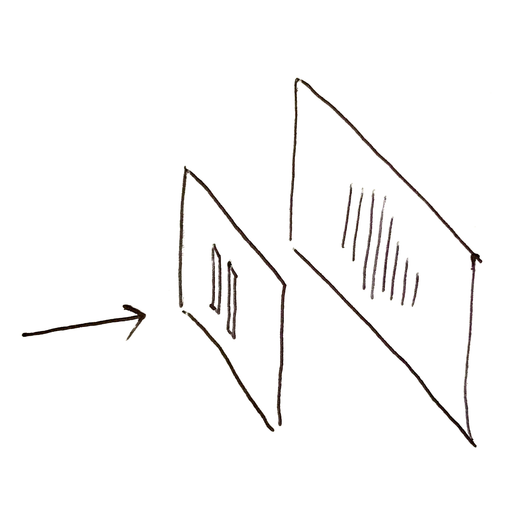
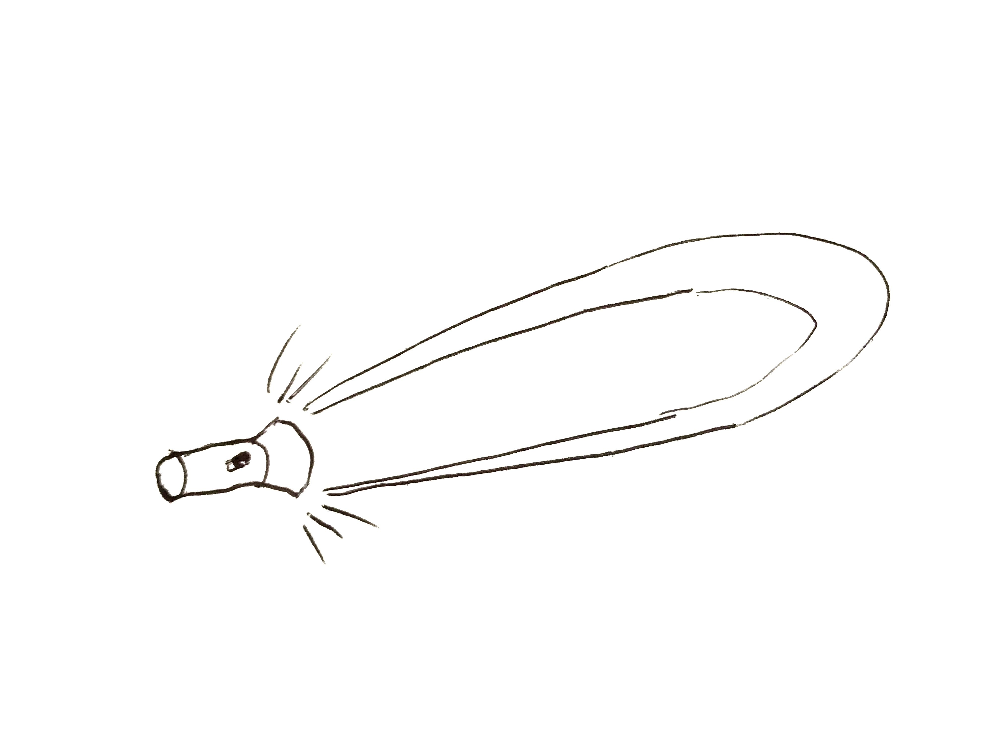
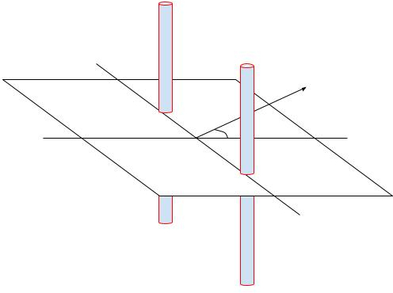
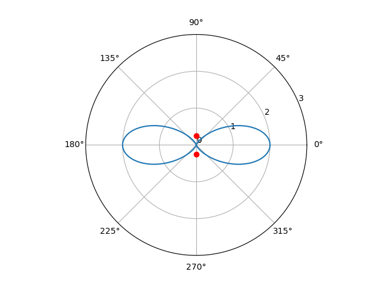
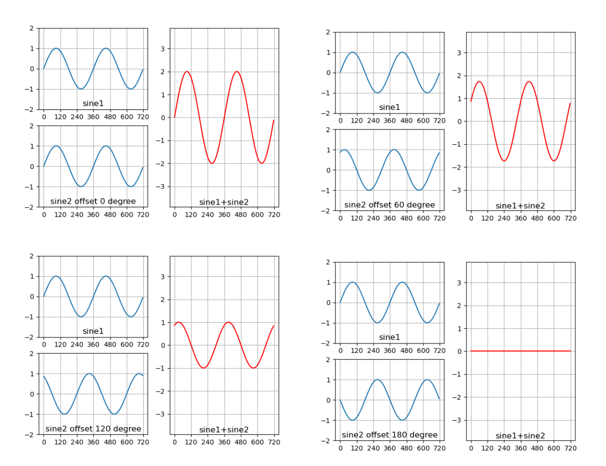

The image above shows the world-famous double-slit experiment, which has been known for over 200 years. It served as perfect proof that light is a wave, thoroughly refuting Newton's particle theory. Even today, many people still debate over its quantum mechanical explanations. Interestingly, this experiment has a close connection to the beamforming technology we use daily in Wi-Fi/4G/5G networks.

Firstly, what is a beam?

Imagine the beam of light emitted from a flashlight. Abstractly, it's the electromagnetic waves (the receiver's sensitivity to electromagnetic waves) being stronger in one direction and weaker in others, thus forming a beam.



Starting with the conventional "spherical chicken in a vacuum," if a wave source radiates uniformly in all directions, it forms an "omnidirectional" beam. This leads to two essential parameters needed to define a beam: direction and strength.

To explain these two aspects, for convenience, let's use a two-dimensional model by applying a dimensional reduction to the "spherical chicken in a vacuum." We will consider the beam pattern of the "rod" antenna commonly used in Wi-Fi routers in the horizontal direction.


Imagine looking down from above at the horizontal plane around the antenna shown in the previous image. In this overhead view, the antenna appears as a small circle. If the antenna radiates uniformly in all horizontal directions, its beam pattern on the horizontal plane would look like the following image:


In the diagram, the range from 0 to 360 degrees represents the various directions indicated by the theta angle in the previous image. The red circle at the center is how the antenna appears in the overhead view, and the number 1 on the blue circle indicates that the radiation strength is 1 in all theta angle directions. The value 1 can be understood as an ideal reference unit (corresponding to a gain of 0dB, but due to losses, it generally doesn’t reach 0dB; for simplicity, we’ll ignore the losses for now). The command to draw the above result is as follows:

```
git clone https://github.com/JiaoXianjun/sdrfun.git
cd sdrfun/beamforming/python/
python3 -c "from beamforminglib import *; ant_array_beam_pattern(freq_hz=2450e6, array_style='linear', num_ant=1, ant_spacing_wavelength=0.5)"
```

The parameters mean: 2.45GHz carrier frequency, linear array, 1 antenna, antenna spacing of 0.5 wavelength.

Let's add a second antenna, with the two antennas spaced 6.1cm apart, which is half the wavelength of the 2.45GHz frequency electromagnetic wave:



Then the beam pattern produced by these two antennas would look like the following image:



As can be seen, in the 0 and 180 degree directions, the radiation from the antennas has doubled, going from 1 to 2 (which corresponds to a 3dB gain), while in the 90 and 270 degree directions, the radiation disappears, becoming 0. The beam pattern seems an "8" shape. The corresponding command to draw the result (the only changed parameter is the number of antennas, from 1 to 2) is as follows:

```
python3 -c "from beamforminglib import *; ant_array_beam_pattern(freq_hz=2450e6, array_style='linear', num_ant=2, ant_spacing_wavelength=0.5)"
```

This is quite interesting. While the addition of multiple antennas is intended to improve the signal, it unexpectedly makes the signal worse in some directions (the directions where the blue "8" shape is less than 1). It seems that effectively using multiple antennas in Wi-Fi routers is not easy/straight-forward, and we'll discuss the multi-antenna setup of Wi-Fi routers in a later article. 

Returning to the "8" shaped beam pattern above, it can actually be easily explained: each antenna still radiates omnidirectionally, but the superposition of the electromagnetic waves from the two antennas in space results in different strengths in different directions. For example, in the 0/180 degree directions, the electromagnetic waves from the two antennas remain strictly in sync with when they left the antennas, because the distance from each point to the two antennas is the same in these directions, meaning the electromagnetic waves from the two antennas maintain the same phase. Imagine two sine waves with the same phase being superimposed; naturally, they become stronger. In the 90/270 degree directions, however, the distance from each point to the two antennas differs by half a wavelength (the antenna spacing), which means there is a 180-degree phase difference, completely opposite. Imagine two sine waves with a 180-degree phase difference being superimposed; of course, they cancel each other out. In the directions between these two, the situation is between the two extremes.

The situation where two sine waves are superimposed with different phases is illustrated in the following image:



The command to draw the above results is as follows (please manually modify the phase difference parameter `offset_degree` in the script):

```
python3 test_sine_offset_combine.py
```

It shows the superposition of two sine waves with phase differences of 0 degrees, 60 degrees, 120 degrees, and 180 degrees, respectively. You can draw the situation with different phase differences by modifying the `offset_degree` variable in the script `test_sine_offset_combine.py`.

Now, the question is: using the same radio wave beamforming code, if we set it to the parameters of double-slit interference in the case of light, can we reproduce the double-slit interference of light? Let's start experimenting.

(To be continued ...)

<div id="disqus_thread"></div>
<script type="text/javascript">
    /* * * CONFIGURATION VARIABLES: EDIT BEFORE PASTING INTO YOUR WEBPAGE * * */
    var disqus_shortname = 'jiaoxianjun'; // required: replace example with your forum shortname

    /* * * DON'T EDIT BELOW THIS LINE * * */
    (function() {
        var dsq = document.createElement('script'); dsq.type = 'text/javascript'; dsq.async = true;
        dsq.src = '//' + disqus_shortname + '.disqus.com/embed.js';
        (document.getElementsByTagName('head')[0] || document.getElementsByTagName('body')[0]).appendChild(dsq);
    })();
</script>
<noscript>Please enable JavaScript to view the <a href="http://disqus.com/?ref_noscript">comments powered by Disqus.</a></noscript>


<!-- Global site tag (gtag.js) - Google Analytics -->
<script async src="https://www.googletagmanager.com/gtag/js?id=G-01GGQ8JZW7"></script>
<script>
  window.dataLayer = window.dataLayer || [];
  function gtag(){dataLayer.push(arguments);}
  gtag('js', new Date());

  gtag('config', 'G-01GGQ8JZW7');
</script>

<script async src="https://pagead2.googlesyndication.com/pagead/js/adsbygoogle.js?client=ca-pub-1542618827905251"
     crossorigin="anonymous"></script>
